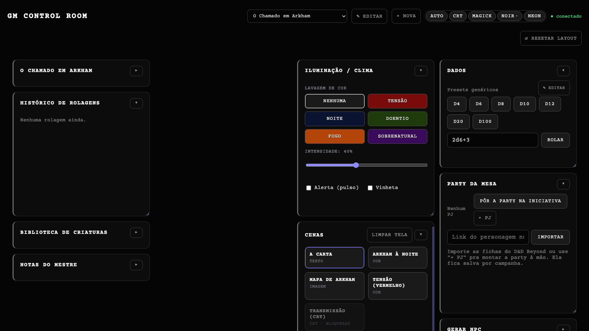
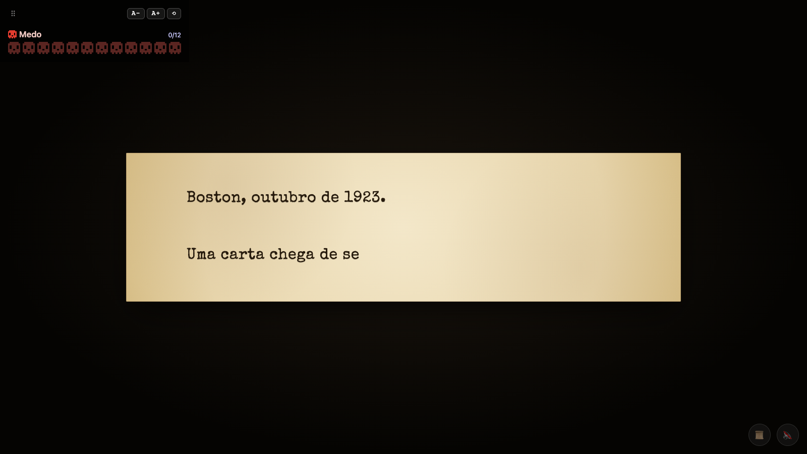
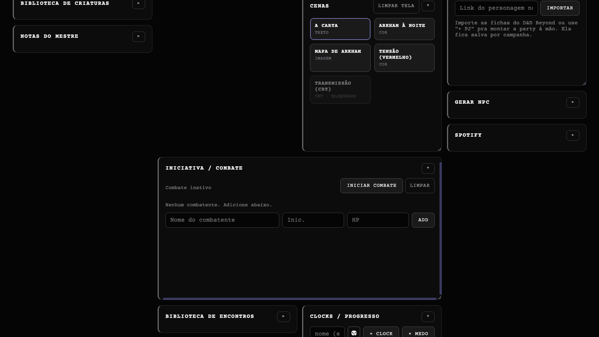

# GM Control Room

[](https://github.com/flippelt/gm-control-room/actions/workflows/ci.yml) [](https://github.com/flippelt/gm-control-room/releases)  [](https://github.com/flippelt/gm-control-room/commits) [](https://github.com/flippelt/gm-control-room/blob/main/LICENSE)   

Painel de controle de sessão de RPG em tempo real. O mestre opera de qualquer dispositivo (iPad, Android, PC ou Mac) e controla uma **tela dos jogadores** (TV/projetor) — cenas, iluminação, áudio, Spotify, dados, tracker de combate e notas. Funciona offline na rede local.

**Motor agnóstico de sistema**: nada de regras embutidas no servidor; sistemas RPG vêm do monorepo [`@lippelt/srd-*`](https://github.com/flippelt/gmcr-srd-systems) (D&D 5e, Pathfinder, Lancer, GUMSHOE, Daggerheart, Candela Obscura e mais).

## Screenshots







## Início rápido

```bash
git clone https://github.com/flippelt/gm-control-room.git
cd gm-control-room
npm install
npm run dev          # dev: server 4000 + client 5173
# OU:
npm run build && npm start   # produção: tudo na porta 4000
```

- Painel do mestre: `/control`
- Tela dos jogadores: `/display` (PWA instalável; QR da LAN aparece no boot)

## Recursos

- 🎬 **Cenas** — texto (typewriter/scroll/terminal), cor, imagem, CRT — com gating de gênero/época
- 🌗 **Iluminação** — washes, alerta pulsante, vinheta
- 🔊 **Mixer de áudio** — multi-camada na tela dos jogadores (autoplay-safe)
- 🎵 **Spotify** — transport, shuffle/repeat, dispositivos Connect, playlists
- 🎲 **Dados** — notação livre + presets do sistema + histórico
- ⚔️ **Tracker** — iniciativa, HP/maxHP, status, campos por sistema
- 📝 **Notas do mestre** — área livre persistida (invisível pro display)
- 🔗 **Atalhos** — apps externos + abrir pasta de assets local
- 📱 **PWA** — tela dos jogadores instalável (offline-capable)
- 💾 **Persistência** — `.session.json` retoma estado ao reiniciar

## Documentação

Documentação completa na **[Wiki](https://github.com/flippelt/gm-control-room/wiki)**:

**Setup:** [Quick Start](https://github.com/flippelt/gm-control-room/wiki/Quick-Start) · [Spotify](https://github.com/flippelt/gm-control-room/wiki/Spotify) · [Development](https://github.com/flippelt/gm-control-room/wiki/Development)

**Conteúdo:** [Campaigns](https://github.com/flippelt/gm-control-room/wiki/Campaigns) · [Scenes](https://github.com/flippelt/gm-control-room/wiki/Scenes-and-Treatments) · [Lighting](https://github.com/flippelt/gm-control-room/wiki/Lighting-and-Atmosphere) · [Audio](https://github.com/flippelt/gm-control-room/wiki/Audio-Mixer) · [Shortcuts](https://github.com/flippelt/gm-control-room/wiki/Shortcuts-and-Assets)

**Ferramentas:** [Combat Tracker](https://github.com/flippelt/gm-control-room/wiki/Combat-Tracker) · [Creature Library](https://github.com/flippelt/gm-control-room/wiki/Creature-Library) · [Encounter Library](https://github.com/flippelt/gm-control-room/wiki/Encounter-Library) · [Clocks](https://github.com/flippelt/gm-control-room/wiki/Clocks) · [Party Resources](https://github.com/flippelt/gm-control-room/wiki/Party-Resources) · [Random Tables](https://github.com/flippelt/gm-control-room/wiki/Random-Tables) · [Dice](https://github.com/flippelt/gm-control-room/wiki/Dice-and-Roll-History) · [Notes](https://github.com/flippelt/gm-control-room/wiki/GM-Notes) · [RPG Systems](https://github.com/flippelt/gm-control-room/wiki/RPG-Systems)

**Display:** [Display and PWA](https://github.com/flippelt/gm-control-room/wiki/Display-and-PWA) · [Skins](https://github.com/flippelt/gm-control-room/wiki/Skins-and-Themes) · [Persistence](https://github.com/flippelt/gm-control-room/wiki/Persistence)

**Arquitetura:** [Architecture](https://github.com/flippelt/gm-control-room/wiki/Architecture) · [Socket Events](https://github.com/flippelt/gm-control-room/wiki/Socket-Events)

## Família

| Projeto | Papel |
|---|---|
| [gmcr-srd-systems](https://github.com/flippelt/gmcr-srd-systems) | regras SRD (`@lippelt/srd-*`) |
| [rpg-prop-kit](https://github.com/flippelt/rpg-prop-kit) | CRT nas cenas |
| [session-kit](https://github.com/flippelt/session-kit) | YAML de sessão → campanha/cenas deste painel |
| [Campaign Codex](https://github.com/flippelt/campaign-codex) | wiki da campanha · [demo](https://flippelt.github.io/campaign-codex/) |
| [Immersive Terminal](https://github.com/flippelt/Immersive-Terminal-for-RPGs) | prop CRT na mesa · [demo](https://flippelt.github.io/Immersive-Terminal-for-RPGs/) |

## Licença

MIT
